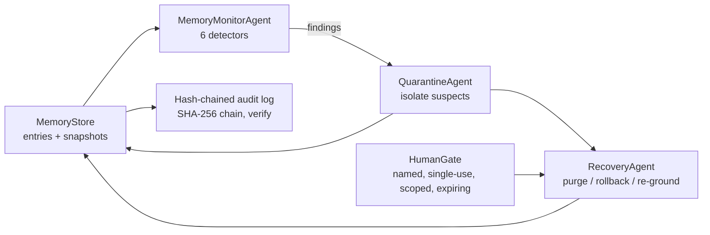
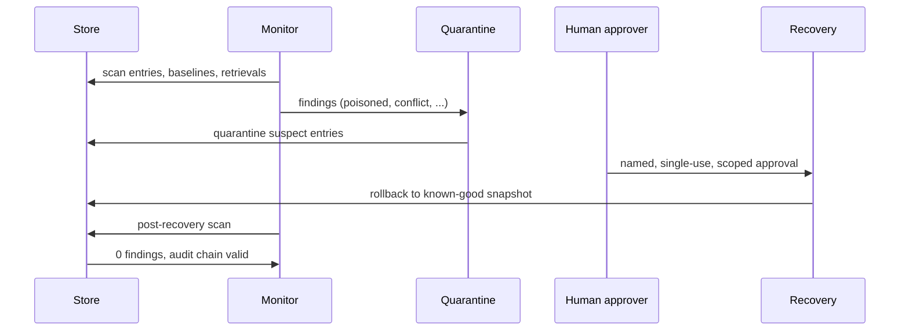
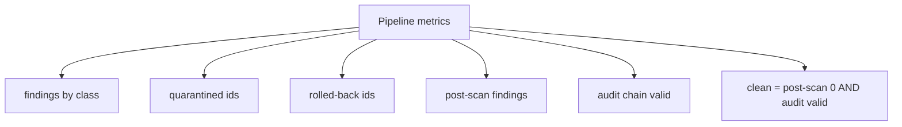

# Architecture diagrams

## Agent loop

```mermaid
flowchart LR
    Store[MemoryStore\nentries + snapshots] --> Monitor[MemoryMonitorAgent\n6 detectors]
    Monitor -->|findings| Quarantine[QuarantineAgent\nisolate suspects]
    Quarantine --> Store
    Quarantine --> Recovery[RecoveryAgent\npurge / rollback / re-ground]
    Gate[HumanGate\nnamed, single-use, scoped, expiring] --> Recovery
    Recovery --> Store
    Store --> Audit[Hash-chained audit log\nSHA-256 chain, verify]
```

## Detection-to-recovery sequence

```mermaid
sequenceDiagram
    participant S as Store
    participant M as Monitor
    participant Q as Quarantine
    participant H as Human approver
    participant R as Recovery
    M->>S: scan entries, baselines, retrievals
    M->>Q: findings (poisoned, conflict, ...)
    Q->>S: quarantine suspect entries
    H->>R: named, single-use, scoped approval
    R->>S: rollback to known-good snapshot
    M->>S: post-recovery scan
    S->>M: 0 findings, audit chain valid
```

## Measurement

```mermaid
flowchart TD
    Metrics[Pipeline metrics] --> Findings[findings by class]
    Metrics --> Quar[quarantined ids]
    Metrics --> Roll[rolled-back ids]
    Metrics --> Post[post-scan findings]
    Metrics --> AuditOK[audit chain valid]
    Metrics --> Clean[clean = post-scan 0 AND audit valid]
```
